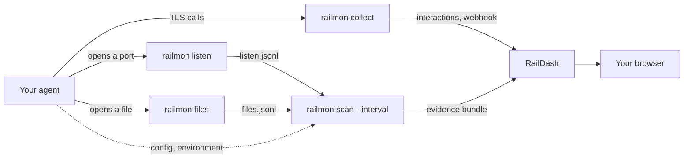

# DatRail

**Runtime guardrails for AI agents, learned from what the agent actually does.**

DatRail watches an AI agent while it runs: the APIs it calls, the files and
data it touches, the ports it opens. It turns those observations into an
**Agent Security Profile (ASP)**. Once you lock an ASP as the agent's baseline,
every later observation is compared with it, and anything new is reported as
drift. A **Data Guardrail** adopted from that baseline then checks every ASP
and every captured request against four rules you approve: allowed uploads,
saved-file kinds, no service ports and no out-of-spec calls.

This repository is the starting point. It runs the open-source DatRail stack
on your own machine with one command, and links to every component.

## Quick start

You need Linux on x86_64 with Docker Engine and Compose v2, and a kernel with
BTF (`/sys/kernel/btf/vmlinux` exists). On Windows, use WSL2, with Docker
Engine in the distro or Docker Desktop running with WSL integration on for
it; [INSTALL.md](INSTALL.md#platform-support) says what each can watch. See
[INSTALL.md](INSTALL.md#prerequisites) for details.

```bash
git clone https://github.com/datrail/datrail-project.git
cd datrail-project
docker compose up -d
```

The first run builds the RailMon and RailDash images from source, which takes
several minutes. Then open **<http://127.0.0.1:8000>**.

### What you see in RailDash

The stack comes with a small demo agent that serves HTTPS on port 8443 and
calls itself every 30 seconds. Nothing needs to be restarted or imported by
hand:

- **Interactions.** Each request the demo agent makes appears within seconds,
  with its destination, method, path and status.
- **Agent Security Profile alignment.** RailMon scans `demo-agent` every
  60 seconds. A scan that finds something new arrives as a new ASP; a scan
  that finds nothing new keeps the same ASP rather than adding a copy. The
  ASP's observed listeners include `127.0.0.1:8443`, and its observed file
  access lists the files the agent opened to read, write or run; click
  **Inspect evidence** on the ASP to see them.
- **Drift.** Once the demo agent has made a few calls (a couple of
  minutes after start), lock the newest ASP as the baseline, and it shows as
  **aligned**. An ASP from before its first call lacks the files that call
  reads, so locking it means one drift on `observed_file_access` later.
  Make the agent open a port it did not have before:

  ```bash
  docker exec -d datrail-demo-agent python3 -m http.server 9000 --bind 127.0.0.1
  ```

  Within a minute the next ASP shows **drift detected**. The changed
  attributes are `observed_listeners`, with the new port, and
  `observed_file_access`, with the files the new server process read; the
  per-attribute detail under the drift list shows the old and new values.
  You can accept the new state as a new baseline, or switch back to an
  earlier one.
- **Data Guardrail.** With a baseline locked, the **Data Guardrail** panel
  proposes a guardrail from it: what the agent already did is allowed, and
  every line is shown before you approve it. The proposal also lists what
  would be a violation under it. For the demo agent that is its own port
  8443 and its calls to `127.0.0.1`, which its configuration doesn't
  declare (and port 9000, if you opened it above). Click **Adopt**, then
  **Allow this** on each row you mean to allow. Once the next scan and
  capture arrive (a minute or two), the agent reads **Held**. Now make the
  agent break a rule:

  ```bash
  # saved_files: a file the guardrail doesn't allow
  docker exec datrail-demo-agent sh -c 'mkdir -p /data && echo report > /data/report.zip'
  # uploads and out_of_spec_calls: a POST with a body to a host on neither list.
  # It goes to the agent's own server with another Host header, so nothing
  # leaves your machine.
  docker exec datrail-demo-agent python3 -c '
  import http.client, ssl
  c = http.client.HTTPSConnection("127.0.0.1", 8443, context=ssl._create_unverified_context())
  c.request("POST", "/upload", body=b"{\"report\": 1}",
            headers={"Host": "exfil.example", "Content-Type": "application/json"})
  print(c.getresponse().status)'
  ```

  The agent turns **Violated**, with one row per rule and item. **Acknowledge**
  a row to clear it until the same thing happens again; **Allow this** makes a
  new guardrail version that allows it. Edit, switch to an earlier version or
  turn the guardrail off from the same panel.

To watch your own agent instead of the demo, see
[INSTALL.md](INSTALL.md#watch-your-own-agent).

### Stop

```bash
docker compose down        # stop; the dashboard's data is kept
docker compose down -v     # stop and delete the data
make clean                 # also delete the built images and an older stack version's leftovers
```

## How it fits together



| Component | What it does |
| --- | --- |
| [RailMon](https://github.com/datrail/railmon#readme) | Collects evidence: captures the agent's TLS traffic, records the sockets and files it opens, and scans its environment into evidence bundles on an interval. |
| [RailDash](https://github.com/datrail/raildash#readme) | Local dashboard. Stores interactions and ASPs, locks baselines, shows drift, and runs the Data Guardrail. |
| [eBPF TLS Tap](https://github.com/datrail/ebpf-tls-tap#readme) | Standalone Linux eBPF probes: `sslsniff` (TLS plaintext), `listensnoop` (listening sockets, behind `railmon listen`) and `filesnoop` (file opens, behind `railmon files`). |
| [DatRail Proxy](https://github.com/datrail/proxy#readme) | Sits between an agent and its MCP servers and attaches an `x-rail` identity ticket to each call. |
| [DatRail Gateway](https://github.com/datrail/gateway#readme) | Sits in front of an MCP server, checks the `x-rail` ticket against policy, and forwards or refuses the call. |

The stack in this repository runs RailMon and RailDash. The proxy and gateway
are deployed separately; their READMEs explain how.

## Documentation

- [INSTALL.md](INSTALL.md): prerequisites, platform support, settings,
  watching your own agent, building from local checkouts, troubleshooting.
- [docs/glossary.md](docs/glossary.md): evidence bundle, ASP, baseline,
  alignment, drift, Data Guardrail, profile.
- [The DatRail organization](https://github.com/datrail): every repository,
  and the project's background.

## License

Apache-2.0. See [LICENSE.txt](LICENSE.txt) and [NOTICE.txt](NOTICE.txt).
